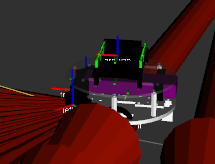

[![Contributors][contributors-shield]][contributors-url]
[![Forks][forks-shield]][forks-url]
[![Stargazers][stars-shield]][stars-url]
[![Issues][issues-shield]][issues-url]
[![MIT License][license-shield]][license-url]
[![LinkedIn][linkedin-shield]][linkedin-url]

 

  

  <h3 align="center">Amazebot Description Package</h3>

  

    This package contains the descriptions and models of the Amazebot based on the robotcraft2019 robot proposed by Ingeniarius.
     
    <a href="https://github.com/robotcraft19/robotcraft-model-description"><strong>Explore the docs »</strong></a>
     
     
    <a href="https://github.com/robotcraft19/robotcraft-model-description">View Demo</a>
    ·
    <a href="https://github.com/robotcraft19/robotcraft-model-description/issues">Report Bug</a>
    ·
    <a href="https://github.com/robotcraft19/robotcraft-model-description/issues">Request Feature</a>
  

## About the Project

  

The robot description and model based on the actual amazebot.

## Setup

To setup ROS, run the "install_melodic.sh" script in the scripts directory using `sh install_melodic.sh` or `chmod+x scripts/install_melodic.sh && ./ install_melodic.sh`

You can also use tutorials. There's a bunch of them, including in the ros wiki.

Now that you have ROS, to setup the project on your local machine:

1. Click on `Fork`.
2. Go to your fork and `clone` the project to your local machine, in the "catkin_ws" folder.
4. `git clone https://github.com/robotcraft19/robotcraft-model-description.git`
5. Make sure you have rosdep install : `sudo apt-get install python-rosdep && sudo rosdep init`
6. `cd ~/catkin_ws`
7. `rosdep install --from-paths src --ignore-src -r -y`
8. In the catkin workspace : `catkin_make`

If everything went smoothly, you should now have this repo's package as well as its dependencies.

## Run

- Display the Robot : `roslaunch robotcraft-model-description display_robotcraft2019.launch`

A better look at the robot can be taken with the robotcraft-model-description package, using the stage_test launch file.

## Contributors

Everyone part of the original team or that assisted throughout the development.

- [Gonsalo S. Martins](https://github.com/gondsm)
- [Ingeniarius Ltd.](https://ingeniarius.pt)

## License

Distributed under the MIT License. See `LICENSE` for more information.

[contributors-shield]: https://img.shields.io/github/contributors/robotcraft19/robotcraft-model-description.svg?style=flat-square
[contributors-url]: https://github.com/robotcraft19/robotcraft-model-description/graphs/contributors
[forks-shield]: https://img.shields.io/github/forks/robotcraft19/robotcraft-model-description.svg?style=flat-square
[forks-url]: https://github.com/robotcraft19/robotcraft-model-description/network/members
[stars-shield]: https://img.shields.io/github/stars/robotcraft19/robotcraft-model-description.svg?style=flat-square
[stars-url]: https://github.com/robotcraft19/robotcraft-model-description/stargazers
[issues-shield]: https://img.shields.io/github/issues/robotcraft19/robotcraft-model-description.svg?style=flat-square
[issues-url]: https://github.com/robotcraft19/robotcraft-model-description/issues
[license-shield]: https://img.shields.io/github/license/robotcraft19/robotcraft-model-description.svg?style=flat-square
[license-url]: https://github.com/robotcraft19/robotcraft-model-description/blob/master/LICENSE.md
[linkedin-shield]: https://img.shields.io/badge/-LinkedIn-black.svg?style=flat-square&logo=linkedin&colorB=555
[linkedin-url]: https://linkedin.com/in/erwinlejeune-lkn
